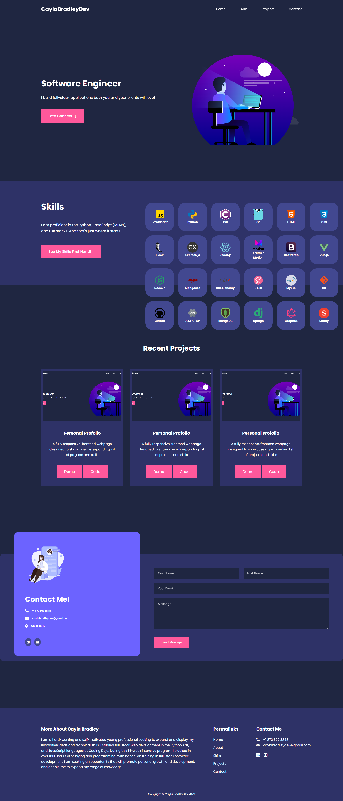

# Portfolio Project

## About

A **_Personal Portfolio Project_** showcasing my evergrowing skills and projects.

This project utilizes `JavaScript` and the `FontAwesome Icons Library`. It was designed to practice Advanced Frontend development concepts such as DOM manipulation, Event Propagation, Intersection Observer API, CSS Grid, and more.

## Demo

[Simple Portfolio Demo](https://caylabradleydev-simpleportfolio.netlify.app/)

---

---

## Technology

- JavaScript
- CSS
- HTML5

## Concepts

- Advanced DOM Manipulation
- Lifecycle DOM Events
- DOM Traversing
- Event Handling
- Event Propagation
- Event Delegation
- Intersection Observer API
- CSS Custom Properties
- CSS Grid
- BEM Naming Conventions
- Semantic HTML

## Updates

**Features for version 1.0:**

- [ ] Responsive Layout
  - [x] Large+ Screens
  - [ ] Medium Screens
  - [ ] Small Screens

**Features for version 2.0:**

- [ ] React.js Frontend

**Features for 3.0**

- [ ] MongoDB database
- [ ] Node.js backend
